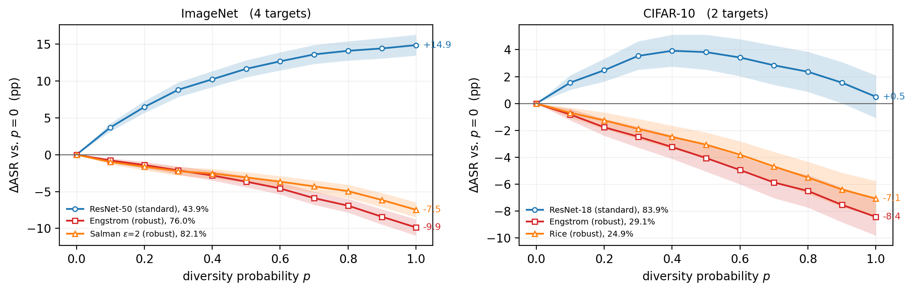

# The Scissors Effect

[](https://openreview.net/forum?id=b4pCcgJM0M)
[](https://arxiv.org/abs/2606.22516)
[](https://avalon-s.github.io/ScissorsEffect/)
[](https://huggingface.co/Avalon-S/ScissorsEffect)
[](LICENSE)

Code for **"The Scissors Effect: When Resize-Based Input Diversity Helps or Hurts
Transfer Attacks"**, published in *Transactions on Machine Learning Research*
(2026).

Input Diversity (DI) applies a random resize and pad at each attack iteration.
It is a near-default ingredient of transfer-based attacks, and is widely assumed
to improve transferability. Holding the attack fixed and varying only the surrogate,
raising the DI probability improves transfer from standard surrogates but
degrades it from adversarially trained ones: the two response curves separate
like a pair of scissors. This repository reproduces those measurements and the
symbolic and numerical verification of the theory that explains them.

[](https://avalon-s.github.io/ScissorsEffect/)

Change in transfer ASR against the diversity probability, relative to no
diversity. Legend entries give each surrogate's ASR at p=0. This is Figure 1 of
the paper, drawn from the per-image outcomes in `results/`; regenerate it with
`python scripts/plot_fig1_scissors.py`. Click it for the
[project page](https://avalon-s.github.io/ScissorsEffect/), where the same curves
are a slider you can drag.

## Setup

### 1. Clone and create an environment

```
git clone https://github.com/Avalon-S/ScissorsEffect
cd ScissorsEffect
conda create -n scissors python=3.9 -y
conda activate scissors
```

### 2. Install PyTorch

Install the build that matches your CUDA from [pytorch.org](https://pytorch.org),
before the rest, so pip does not pull a CPU-only wheel. We ran `torch 2.8.0+cu128`
and `torchvision 0.23.0+cu128` on Python 3.9, on a single RTX 4090 (24 GB);
`torch>=1.10` should work.

### 3. Install the remaining dependencies

```
pip install -r requirements.txt
```

This installs `robustbench` 1.1.1 from PyPI, which supplies the model zoo and the
CIFAR loaders. RobustBench declares `autoattack` as a git dependency, so git has
to be on `PATH` and GitHub reachable.

### 4. TransferAttack

Six scripts need it: `run_modern_attacks.py`, `run_modern_attacks_perimage.py`,
`run_classical_attacks_cifar.py`, `run_gradient_alignment.py`,
`run_ssa_decomposition.py` and `run_ssa_regime_sweep.py`. It is not on PyPI, and
every number we report from it was produced at commit `8bfe600c`:

```
git clone https://github.com/Trustworthy-AI-Group/TransferAttack external/TransferAttack
git -C external/TransferAttack checkout 8bfe600c21dddc3be974bcca5b17f3183dbb972c
export PYTHONPATH=$PWD/external/TransferAttack:$PYTHONPATH
```

The commit matters. TransferAttack's defaults have changed since, and the
absolute ASR values in the ten-attack table are not comparable across versions.

### 5. Datasets

```
export DATA_ROOT=/path/to/datasets
```

`DATA_ROOT` holds `ImageNet/val/`, `CIFAR-10/` and `CIFAR-100/`. CIFAR-10 and
CIFAR-100 download themselves on first use through RobustBench; the ImageNet
validation set you have to supply, unpacked into `ImageNet/val/`. Without
`DATA_ROOT` the loader falls back to `./assets/` and then to the paths of the
machine we ran on, which is why the fallbacks in `data/loader.py` name absolute
directories.

### 6. Checkpoints

```
export MODEL_ROOT=/path/to/checkpoints
```

`MODEL_ROOT` follows the RobustBench layout, plus one directory for the
surrogates we trained ourselves:

```
<MODEL_ROOT>/imagenet/Linf/       robust ImageNet sources
<MODEL_ROOT>/cifar10/Linf/        robust CIFAR-10 sources
<MODEL_ROOT>/cifar100/Linf/       robust CIFAR-100 sources
<MODEL_ROOT>/cifar10/standard/    naturally trained CIFAR-10 surrogates
```

Most weights arrive on their own. The robust sources on all three datasets are
RobustBench model ids and download from its zoo; the naturally trained ImageNet
models, used both as sources and as the transfer targets, come from torchvision;
the CLIP surrogate in the appendix comes from `open_clip`. Three groups do not,
and the loader raises rather than substituting random weights when one is
missing.

**The Salman epsilon-spectrum**, five ResNet-50 checkpoints behind the controlled
robustness sweep, from
[madrylab/robust-imagenet-models](https://huggingface.co/madrylab/robust-imagenet-models).
Put them in `imagenet/Linf/` under the names the release uses, which is what
`models/loader.py` looks for:

```
resnet50_linf_eps0.5.ckpt   resnet50_linf_eps1.0.ckpt   resnet50_linf_eps2.0.ckpt
resnet50_linf_eps4.0.ckpt   resnet50_linf_eps8.0.ckpt
```

**The ARES ConvNeXt-B adversarially trained model**, one row of the cross-recipe
panel, from ARES-Bench ([Liu et al., 2025](https://github.com/thu-ml/ares)). Place
it at `imagenet/Linf/ARES_ConvNext_Base_AT.pth`. Only `run_recipe_panel.py` reads
it, so every other script runs without it.

**The surrogates we trained.** These five are the only weights in the paper that
exist nowhere else, so they are released on Hugging Face at
[Avalon-S/ScissorsEffect](https://huggingface.co/Avalon-S/ScissorsEffect),
together with the records the training runs wrote:

```
pip install -U huggingface_hub
hf download Avalon-S/ScissorsEffect --local-dir weights
```

Put `c10_*.pt` in `cifar10/standard/` and `Standard_WRN28_10.pt` in
`cifar100/Linf/` under your `MODEL_ROOT`; `SHA256SUMS` in that repository checks
the download. To train them instead, one script does all five, one recipe, both
datasets:

```
python scripts/train_cifar10_standard.py                      # CIFAR-10
python scripts/train_cifar10_standard.py --dataset cifar100   # CIFAR-100
```

The first writes `c10_resnet18.pt`, `c10_resnet50.pt`, `c10_vgg16.pt` and
`c10_densenet121.pt` into `cifar10/standard/`. The second writes
`Standard_WRN28_10.pt` into `cifar100/Linf/`; ours finished at 81.07% clean in
about 2.5 hours on one 4090. Both runs abort if a model ends below a
clean-accuracy floor, so a surrogate that cannot classify its own dataset never
reaches the experiments.

### 7. Check the installation

Three commands. None of them needs a GPU, a dataset or a checkpoint, and all
three exit 0 on a correct installation.

```
python theory/verify_scissors_theorem.py
```

Symbolically checks the closed forms and the crossover, runs the Monte-Carlo
cross-check, and regenerates the theory figures. It also checks that the
crossover does not depend on the resize operator being symmetric or a
contraction, using a deliberately non-symmetric operator of spectral radius 1.30.

```
python scripts/plot_fig1_scissors.py --print-only
```

Rebuilds the six Figure 1 curves from the released per-image outcomes, rather
than leaving the headline figure to be taken on report.

```
python scripts/validate_canonical_moments.py
```

The blocking check on the released gradient moments, described under
[the gradient-moment release](#the-gradient-moment-release) below.

One note on memory: on a 24 GB card, pass `--batch_size 8` to the attack scripts.
VMI-FGSM draws 20 neighbours per step and the default batch will not fit.

## Layout

```
attacks/      attack wrappers (MI/DI-FGSM, PGD) and the CG-DI / LGC probe
data/         dataset loading (CIFAR-10, CIFAR-100, ImageNet)
models/       model loading (RobustBench zoo + torchvision + local checkpoints)
configs/      default experiment config
utils.py      seeding, metrics, helpers
scripts/      one runnable script per experiment or analysis
theory/       symbolic (sympy) + Monte-Carlo verification of the theory
prereg/       pre-registered predictions and their sha256 hashes
results/      the canonical gradient-moment export, the per-image Figure 1
              outcomes, and the two small tables behind the theory figures
docs/         the project page (served by GitHub Pages)
```

Every script takes `--help`. Defaults reproduce the settings reported in the
paper.

## Reproducing the paper

### Experiments

| Script | Produces |
|---|---|
| `run_imagenet_extended.py` | ImageNet Scissors Effect across targets (main table) |
| `run_classical_attacks_cifar.py` | CIFAR-10 transfer results |
| `run_modern_attacks.py` | Ten attacks, 2018–2024 (generalization table) |
| `run_modern_attacks_perimage.py` | Per-image outcomes for the ten-attack panel |
| `run_eps_sweep.py` | Controlled robustness-strength epsilon sweep |
| `run_lgc_eps_sweep.py` | LGC across the epsilon spectrum; LGC–effect correlation |
| `run_recipe_panel.py` | Cross-recipe replication panel (multiple AT recipes / targets) |
| `run_self_transfer_h.py` | Same-family (RN50→RN50) source–target control |
| `run_heldout_cgdi.py` | Held-out evaluation of the CG-DI rule |
| `run_targeted_attack.py` | Targeted-attack generalization |
| `run_imagenet_eps4.py` | Smaller perturbation budget (eps=4/255) |
| `train_cifar10_standard.py` | Trains the naturally trained surrogates; `--dataset cifar100` for the WRN-28-10 |

### Mechanism

| Script | Produces |
|---|---|
| `run_gradient_alignment.py` | Source–target gradient-alignment measurement |
| `run_moment_decomposition.py` | Second moments of the transformed input gradient |
| `run_magnitude_bridge.py` | Per-image control: does sign-alignment mediate flips? |
| `run_trajectory_analysis.py` | Attack-trajectory instrumentation, per step |
| `run_transform_decomposition.py` | Resize vs. translation decomposition |
| `run_factorial_decomposition.py` | 2×2 factorial of resize and translation |
| `run_ssa_decomposition.py`, `run_ssa_decomposition_cifar.py`, `run_ssa_regime_sweep.py` | SSA × transform decomposition |
| `run_interpolation_ablation.py` | Interpolation-mode ablation |
| `run_continuous_p_sweep.py` | Continuous-p sweep behind the binary CG-DI rule |
| `run_lgc_pstar_pilot.py`, `run_extreme_di_expanded.py` | LGC vs. optimal-p, DI aggressiveness |
| `measure_theory_constants.py` | Estimating the theory constants on real surrogates |
| `run_fft_visualization.py`, `gen_fig2_gradient_vis.py`, `gen_fig2_gradient_vis_imagenet.py` | Gradient frequency content and visualization |

### Scoring, statistics and figures

| Script | Produces |
|---|---|
| `analyze_panel_statistics.py` | Dependence-aware statistics for the ten-attack panel |
| `analyze_pstar_identifiability.py` | The continuous-p sweep and the cost of the binary choice |
| `analyze_trajectory_mediation.py` | Trajectory statistics against per-image flips |
| `score_cgdi_vs_metadata.py` | The 27-case probe-versus-provenance tally, at a stated resize rate |
| `score_cgdi_granularity.py` | Per-image against model-level CG-DI |
| `factorial_cis.py`, `factorial_table_allimages.py` | Image-paired intervals for the 2×2 factorial |
| `bootstrap_biasvar.py` | Image-paired bootstrap intervals for the bias–variance table |
| `plot_fig1_scissors.py` | Figure 1, from the per-image outcomes in `results/fig1_*_n1000/*.npz` |
| `plot_fig5_lgc_correlation.py` | The LGC-versus-effect figure, both panels |

### Theory

| Script | Produces |
|---|---|
| `theory/verify_scissors_theorem.py` | Symbolic + Monte-Carlo verification of the crossover theorem |
| `theory/verify_propositions.py` | The probe-statistic bridge and the two accompanying propositions |
| `theory/replot_scatter.py`, `theory/replot_sensitivity.py` | The LGC scatter and the threshold-sensitivity figure |

## The gradient-moment release

`results/moment_decomposition_canonical/` holds the raw second moments the paper
reports: per-image rows for 15 surrogates × 4 transform modes (22,128 rows), the
LGC-bridge probes (27,660 rows), and the two summaries recomputed from them.
`SHA256SUMS` carries a full-file hash of each, so `sha256sum -c SHA256SUMS`
works.

This export is the union of three measurement runs, with the DenseNet-121 rows
taken from the re-measurement rather than from the run whose checkpoint was
defective. `scripts/build_canonical_moments.py` performs that merge. The
pre-registration files under `prereg/` name the original measurement directories
in their `inputs` field, and are kept byte-identical. This export supersedes those
paths as the released data. It is not a different measurement: the frozen
constants re-derive from it, which the validation checks.

```
python scripts/validate_canonical_moments.py --prereg prereg/E6_predictions_20260801T000247Z.json
```

That check is blocking. It verifies the row counts and full-file hashes. It then
re-derives every column of both summaries from the per-image rows: the 16 moment
constants and the 7 bridge columns, including the `crossover` flag and the
`tau_star` missing-value pattern. Last, it checks that the seven pre-registered
held-out predictions are unchanged.

## Pre-registration

`prereg/` holds predictions that were written to disk and hashed before the
corresponding outcome existed, together with the sha256 files recording those
hashes. `gen_e5_prereg.py` and `gen_e6_prereg.py` are the generators.

The recorded hash is of the JSON **body**, not of the whole file: each record
stores its own hash in a `sha256_of_body` field, so a whole-file hash could not
be contained in the file it describes. `sha256sum -c LATEST_SHA256.txt` will
therefore report a mismatch; that is the format, not tampering. To check a
record, drop the `sha256_of_body` key and hash the remaining object as it was
serialised:

```
python - <<'EOF'
import collections, hashlib, json
p = "prereg/E6_predictions_20260801T000247Z.json"
d = json.load(open(p), object_pairs_hook=collections.OrderedDict)
h = d.pop("sha256_of_body")
blob = json.dumps(d, indent=2, sort_keys=False)     # key order as written
print(h == hashlib.sha256(blob.encode()).hexdigest())
EOF
```

The canonical data release under `results/` uses ordinary full-file hashes
instead, so `sha256sum -c` works there. `E5_VOID_NOTE.md` explains why the first
E5 registration is void: its baseline arm had zero draw-to-draw variance, so the
quantity it registered was degenerate by construction. Two of the registered
mechanisms were falsified and are reported as such (E8, transform strength; E9,
transform granularity).

## Citation

```bibtex
@article{jiang2026the,
  title   = {The Scissors Effect: When Resize-Based Input Diversity Helps or Hurts Transfer Attacks},
  author  = {Yuhang Jiang and Xiaojing Chen},
  journal = {Transactions on Machine Learning Research},
  issn    = {2835-8856},
  year    = {2026},
  url     = {https://openreview.net/forum?id=b4pCcgJM0M}
}
```

## License

Code in this repository is released under the [MIT License](LICENSE). The paper
itself is published by TMLR under CC BY 4.0.
